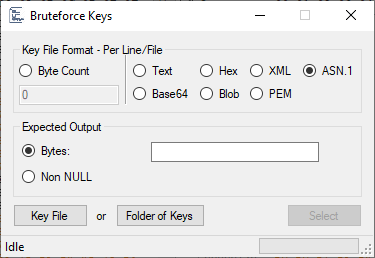

# CryptoTester

A utility for playing with cryptography, geared towards ransomware analysis.

# Hex Views

All hex views used in CryptoTester offer a few enhanced capabilities.

* Null bytes are colored a lighter gray
* Bytes representing ASCII characters are colored orange
* Newline patterns (`0D 0A`) are colored purple
* If pasting is available, any whitespace, newlines, and common delimiters are removed before parsing as hex
* Right-click options for copying bytes as a C Array or BigNum

On many views (e.g. `Input` and `Output`), clicking on the offset row (the `00 01 02 03...` above the respective view) will open a dialog showing the bytes alongside the decoded view.

# Integer Parsing

Most inputs that accept an integer, also accept special values and functions.

Examples:
* **Hex:** `x10` -> 16
* **Input Length:** `len` -> 400
* **Blocksize:** `block` -> 16 (blocksize of the selected algorithm)
* **Round Up:** `up(60, 16)` -> 64
* **Round Down:** `down(60, 16)` -> 48

Simple arithmetic can be used in combination with these functions.

* `up(len-x100, b)` - Subtracts 256 from the input length, then rounds up to the nearest blocksize of the selected algorithm (e.g. 16 for AES)

Any negative values are assumed to be `len - value`, aka relative to the end of the input.

# Main Panel

## Encrypt/Decrypt

The primary panel contains tools for using cryptographic primitives on an input. The `Input` hex view accepts direct pasting of bytes, or the `File` menu can be used to load a file, text, base64-encoded bytes, etc. A file can also be directly drag-and-dropped into the view.

### Key Options

Allows for specifying a key in many formats, and contains options for many hashing and key derivation functions; these fields adapt to the currently selected algorithm and what it can support.

> **Note:** The key is processed in the same order it is shown in the UI; first the key is decoded according to the `Format`, then hashed using the `Hash` parameters, and finally derived using the `Derive` parameters before handing it to the cryptographic algorithm. As of v1.7.0.0, you can swap the order of `Hash` and `Derive` processing.

The final output length of the key is displayed above the input box. Clicking this will display the final computed key in a separate dialog.

### Encryption Options

Allows for selecting a cryptographic algorithm and its parameters, if supported.

> **Note:** The `IV Bytes` (or `Nonce`, depending on algorithm) will automatically fill as `00` bytes of the appropriate length for the algorithm if it is left empty.

### Selection Options

The input can be selected using two different modes: "Range" and "Chunks".

#### Range

A simple range starting at `Offset`, and taking `Length` bytes.

The `Length` will automatically update whenever `Input` is changed, unless the `Lock Parameters` checkbox is ticked.  
If you have made some calculations in the `Length` field, and wish to revert to the actual length of the `Input`, you can simply press the `Reset Length` button.

If `Splice Remaining Bytes` is ticked, then any bytes before `Offset` are prepended to the `Output`, and any bytes after `Offset+Length` are appended.

#### Chunks

Takes `Take` bytes, then skips `Skip` bytes, takes `Take` bytes, skips `Skip` bytes... until the end of `Input`. This can be used for ciphertext that is actually "interleaved" between chunks of plaintext. The cryptographic algorithm is run on the resulting chunks as *one sequential chunk*, with no resetting of the key/IV/nonce etc.

If `Splice Remaining Bytes` is ticked, then any bytes in the `Skip` section are interleaved back into the `Output`.

### Input File Info

This section displays simple information about the `Input` such as the filesize, detected MIME (if it is a file), total entropy, and whether it is divisible by 16 (a common block size).

### Misc

The `Input` and `Output` views have synchronized scrolling; to disable this, uncheck the `Syncronized scrolling` checkbox between them.

The `🡨` button between the `Input` and `Output` can be used to move the `Output` to the `Input` view.

The `Input` or `Output` can be hashed using the respective dropdowns below their views. The `Output` can also have a verify algorithm ran on it (limited support for ECDSA currently).

## Compare

This panel allows for comparing an encrypted file with its original. Both views support drag-and-drop, or `File -> Open File` can be used to open `Original` and `Encrypted` sequentially.  
The `Original` view can also be filled using any of the `File -> Input` options; for example, comparing against a certain length of null bytes or the Windows sample picture `Chrysanthemum.jpg`.

The `Original` and `Encrypted` views have synchronized scrolling; to disable this, uncheck the `Syncronized scrolling` checkbox between them.

The `⇆` button between the `Original` and `Encrypted` views can be used to swap their contents.

Any bytes that differ between the two views will be displayed in dark red.

### Original File / Encrypted File Info

Displays basic information on the `Original` and `Encrypted` views respectively.

### Analysis

Once both views have been filled, a quick analysis is run against them.

* **Hash Analysis:** Checks if any hash of `Original` is present in `Encrypted`
* **Filename:** Checks for common alterations to the filename (e.g. prepended/appended or encoded)
* **BLOB Analysis:** Checks for any CryptoAPI blobs present in `Encrypted`
* **XOR Analysis:** Checks for repeating blocks of XOR (or other simple ciphers)
* **Filename Marker:** Checks if the original filename is present in `Encrypted` (UTF-8 or UTF-16)
* **Filesize Marker:** Checks for the original filesize in `Encrypted` (in various forms and encodings)
* **ASCII Marker / Analysis:** Checks for an ASCII (or base64) marker at beginning or end of `Encrypted`

## Compress/Decompress

This panel allows for primitive use of a handful of compression algorithms, and has similiar functionality to the `Encrypt/Decrypt` panel.

## Tools

### Blob Analyzer

A tool for analyzing CryptoAPI blobs and CNG blobs.

BLOBs can be imported/exported to/from binary, base64, PEM, XML, and ASN.1 formats, where supported.

#### Tools

Additional blob-related tools which are activated only for supported blob types as applicable.

* **Decrypt BLOB:** Allows for decryption of a SIMPLEBLOB by inputting a PRIVATEKEYBLOB
* **RSA Calculator:** Loads the current RSA key into the [RSA Calculator](#rsa-calculator) tool
* **Repair BLOB:** Repairs the BLOB if a recoverable corruption has been detected
* **Blob Generator:** Allows for generating any CryptoAPI blob
* **Flip Endian:** Flips the endianness of the key contents (*may break the key!*)

##### Blob Generator

Generates a CryptoAPI blob. The `Bit Length` is automatically updated with supported values for the selected `aiKeyAlg`. Note that some combinations of `bType` and `aiKeyAlg` are not valid, and will throw an error from the CryptoAPI provider.

> **Note:** Keys are generated internally using [CryptGenRandom](https://learn.microsoft.com/en-us/windows/win32/api/wincrypt/nf-wincrypt-cryptgenrandom), but I cannot guarantee the cryptographic security of using keys generated from this utility.

### RSA Calculator

A tool for analyzing/calculating RSA keys. The seperate parameters of the key are displayed, and can be shown as decimal or hex. If enough parameters are present, the rest of the key can be calculated.

The key can be exported in various formats including a CryptoAPI blob, CNG blob, PEM, XML, and ASN.1, either to file, clipboard, or the Main Window ([Encrypt/Decrypt](#encryptdecrypt)). Additionally, if exporting to the Main Window, the raw integers can be exported for the Raw RSA algorithm.

### Key Finder

A tool that searches a file for a cryptographic key in several formats.

Examples of supported formats:
* CryptoAPI blob
* CNG blob
* ASN.1 blob
* NTRU blob
* All of the above as ASCII hex strings
* All of the above as base64 (or damaged base64)
* PEM keys
* XML keys
* Raw RSA modulus and exponent as hex strings

### RNG Tester

A tool for testing various known PRNG algorithms.

#### Seed Options

Set the starting `Seed` for the PRNG.

#### RNG Options

Set the PRNG `Algorithm`, along with the `Length` of outputs to produce, and an optional `Modulus` to apply to each output. For example, a `Modulus` of `xFF` can be used to cast each output to a byte.

#### Output

* **Format:** Format to output each random number as

If `Alpha` is selected:
* **Charset:** A character set to map against each random number
* **Presets:** Common preset charsets to autofill
* **Skip Chars:** If a character in this list would be output, it is skipped, and the next random number polled

The entropy of the produced output is also displayed for `Alpha` output. This is a rough estimate of entropy (or number of possibilities) for blindly bruteforcing the output (without directly attacking the PRNG).

### Base Encoder

A tool for using different base encodings. Supports standard preset charsets, or supply your own custom charset.

With the exception of encoders that use a checksum (e.g. Bitcoin's Base58Check), decoding is done without verifying the padding, so even partial or damaged encodings will be decoded raw.

### String Encoder

A tool for viewing text or bytes as ASCII, UTF-8, and UTF-16 simultaneously.

### ECC Validator

A tool for validating elliptical curve points. Can import/export from/to an ECPoint (uncompressed or compressed forms), PEM, or CNG blob.

## Operations

Various operations to be performed based on the current panel.

### XOR Files / AND Files

Takes the `Original` and `Encrypted` from the `Compare` panel, and applies the XOR or AND operation, and displays a stream.

### Generate Keystream

Uses the algorithm information from the `Encrypt/Decrypt` panel and generates a keystream of given length to save to file.

### Visual Difference

Displays a graphical chart of difference between pixels in the `Compare` panel.

### Bruteforce Algorithm

Uses the provided key material and `Input` from the `Encrypt/Decrypt` panel, and a given expected output, and enumerates all possible options in the `Encryption Options` section to try and find a match.

### Bruteforce Keys

This tool can be used to test a list or folder of known keys against the `Input` using the specified cipher parameters.

* **Key File Format:** Specify the expected format for the input, such as a base64-encoded key per line, or take `Byte Count` bytes of the file at a time.
* **Expected Output:** The expected output as bytes, or simply any non-null output (should only be used with valid padding schemes)

If a key is successfully matched, the `Select` button will be activated to allow passing the key and its parameters to the main window.

### Attempt Blind Decryption

Using the blocksize of the selected cipher, enumerates over every possible block and attempts decryption using the specified key.

Example: You have an RSA-2048 private key, and a `0x1000` byte blob of possible ciphertext as `Input`. Using this operation will try decrypting `Input[0x00:0x100]`, then `Input[0x01:0x101]`, then `Input[0x02:0x102]` etc...

> **Note:** This operation currently only supports the RSA algorithm. It is also limited to a max of 10000 input bytes.

## Advanced

### Little Endian

Use little endian internally (if algorithm supports it).

### Custom

Allows for setting custom parameters if selected algorithm supports any. For example, the Salsa20 family of algorithms support custom rounds, constant, position, or inputting a raw matrix.

### IV

Options for the IV, such as inputting from text or base64, and recovering an IV from known plaintext.

### Presets

Presets for certain encryption schemes, e.g. OpenSSL.

### Reverse Input Bytes

Simply reverses endianness of `Input`.

## Convert

Small tools for conversions.

### DWORD ⇆ Integer

Convert an integer to DWORD, or DWORD bytes to integer.

### Hex ⇆ Integers

Convert hex bytes to a list of integers, or a list of integers to bytes. Spaces and commas for the output can be optionally set.

